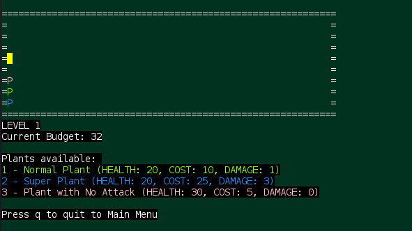
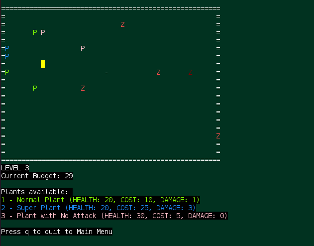
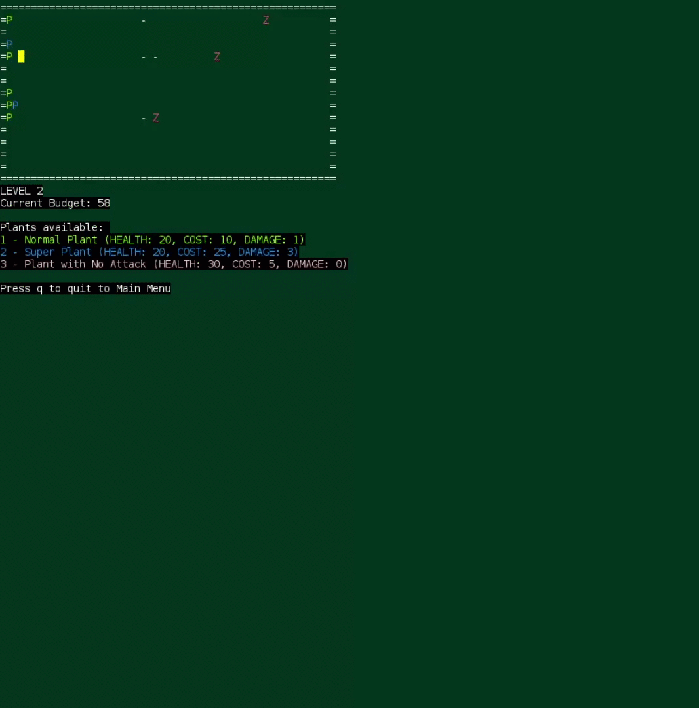
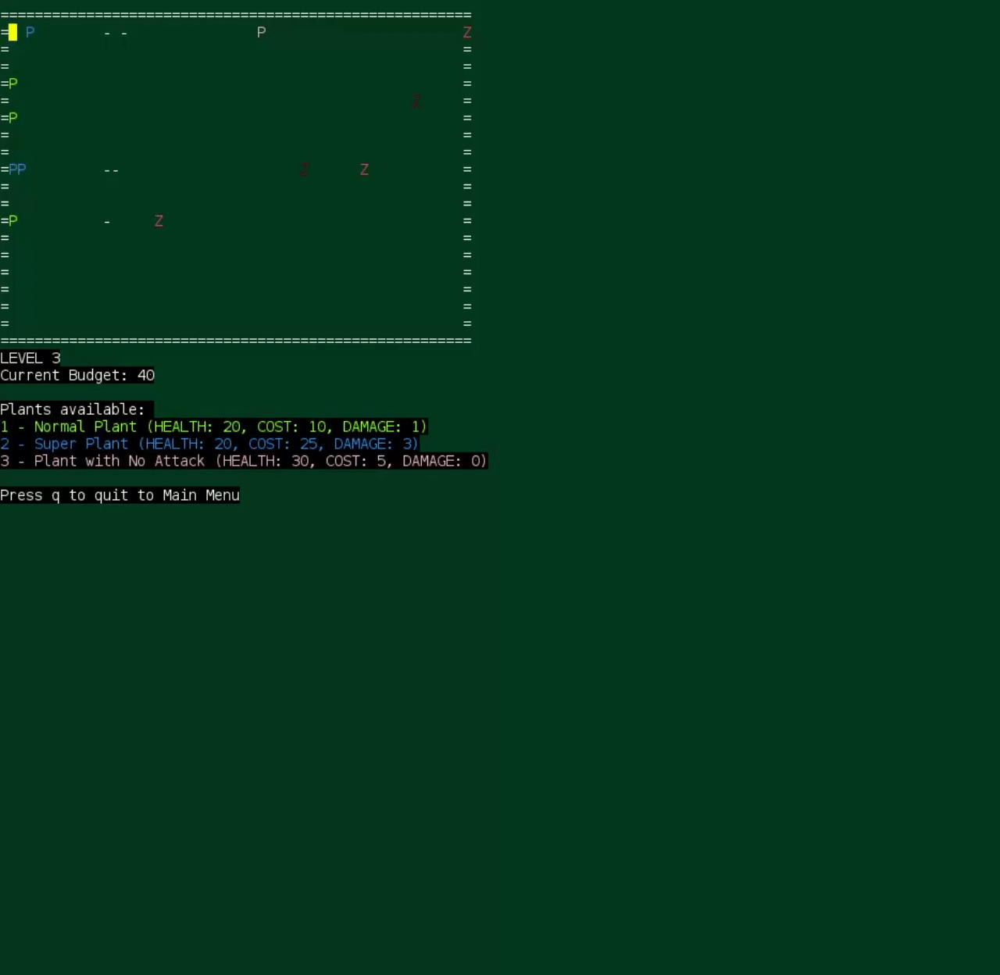
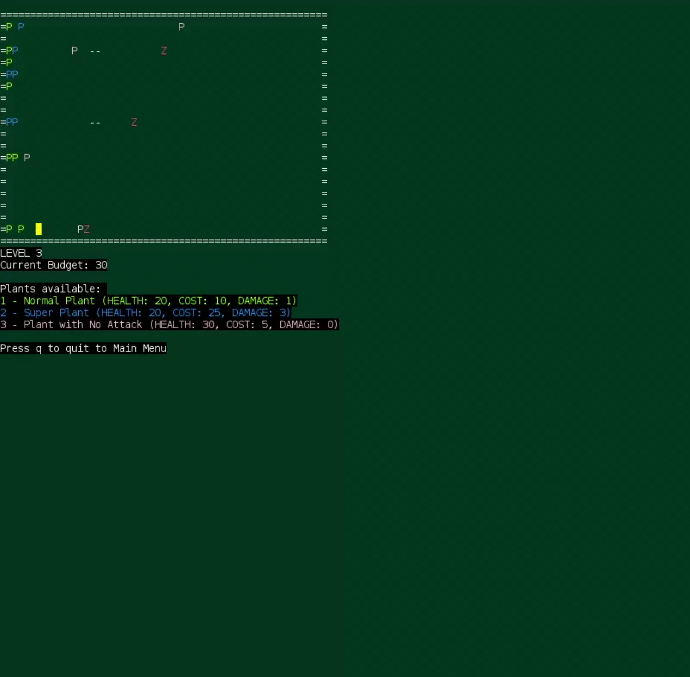

# LPOO_64 - Plants vs Zombies
> Plants vs Zombies is a tower defence lpoo2021.g64PvZ.game in which the player must defend the home by putting down plants that can fire projectiles at the zombies or have another abilities.
> The difficulty increases with time so make sure you save money enough to buy plants. After 3 waves the zombies finally stop and you'll be safe.
> **Will you survive!?**
>
> This project was developed by André Malheiro (up201706280@edu.fe.up.pt), Frederico Lopes(up201904580@edu.fe.up.pt) and Mónica Pereira (up201905753@edu.fe.up.pt)
> 
> **Screenshots**
>
> 
>
> Fig.1 - Garden with plants

> 
>
> Fig.2 - Plant shooting zombie
> 
> 
>
> Fig.3 - Menu
> 
> 
> 
> Level 2
> 
> 
> 
> Level 3
> 
> 
> 
> Victory!!
