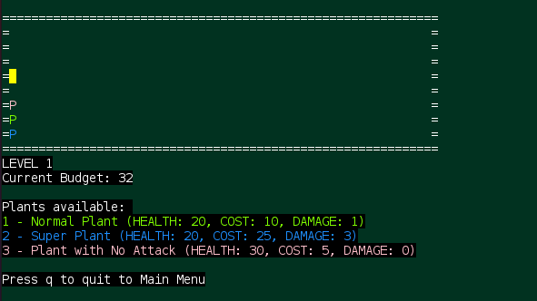
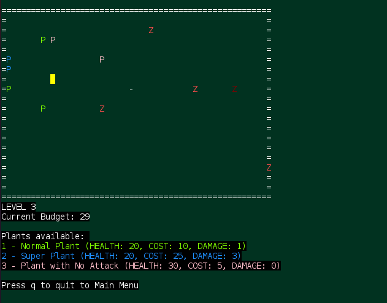
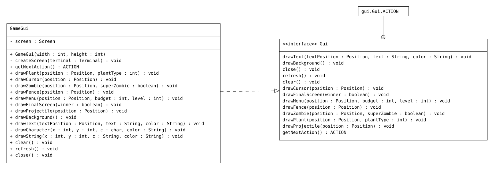

# LPOO_64 - Plants vs Zombies
> Plants vs Zombies is a tower defence game in which the player must defend the home by putting down plants that can fire projectiles at the zombies or have another abilities.
> The difficulty increases with time so make sure you save money enough to buy plants. After 3 waves the zombies finally stop and you'll be safe.
> **Will you survive!?**
>
> Developed by:
> * André Malheiro - up201706280@edu.fe.up.pt
> * Frederico Lopes - up201904580@edu.fe.up.pt
> * Mónica Pereira - up201905753@edu.fe.up.pt

## Implemented Features
> **Garden** - The area were the player can place the plants, delimited by fences and in which the zombies can spawn.
>
> **Cursor** - The player can control the cursor by using the keyboard.
>
> **Menu** - The area where it shows the current budget to buy plants, the different plants available and their different abilities. The Menu also shows the current level that the player is in.
>
> **Zombies** - The zombies move from right to left and can damage plants when they hit them. The game has two zombies, one of them being more damaging to the plants on the garden.
>
> **Plants** - There are 3 types of plants in this game. Two of them shoot projectiles, but the third one doesn't. The plants also differ in price, health and damage.
>
> **Choosing plants** - The player can choose the plant using the keyboard by clicking the key 1, 2, or 3.
>
> **Placing plants** - We can choose the position to place the plant using the keyboard.
>
> **Starting and ending menu** - Menu that shows up in the beginning, and the end where the player ir able to choose between starting the game or exiting
>
> **Main menu** - Menu which lets the player choose to start the game or exit.

> **Screenshots**
>
> 
>
> Fig.1 - Garden with plants
>
> 
>
> Fig.2 - Plant shooting zombie
>
> 
>
> Fig.3 - Menu

## Planned Features
> We were also planning to implement the following features:
>
> **Pause Menu** - While the game is running the player would be able to pause it and the pause menu would show up where the
> player could choose between several options.
>
> **More plants** - We were also planning on adding some more types of plants to buy.

## Design
**Architectural design**
> **Problem in Context**
>
> The first problem we encountered was finding the correct Architectural patterns to use in our project.
> This was really important in the early stages of development because we needed the correct way to separate our code.
>
> **The Pattern**
>
> Facing this problem, we decided to use the Model-View-Controller (MVC) architectural pattern.
> This pattern is commonly used for developing user interfaces that divides an application into three parts.
>
> By using this pattern we were able to divide our code in a way that if we needed to change a feature we wouldn't need to change our entire code.
> Basically our entire game is based in this pattern.
>
> **Implementation**
>
> The following figure shows how we implemented the pattern.
>
> 
>
> [Controller](/src/main/java/lpoo2021/g64PvZ/controller/Controller.java)
> [View](/src/main/java/lpoo2021/g64PvZ/view/Viewer.java)
> [Model](/src/main/java/lpoo2021/g64PvZ/model/garden/Garden.java)
>
> **Consequences**
>
> The use of MVC pattern as previously said has the following benefits:
>
> Easy code maintenance easy to extend and grow;
>
> All classed and objects are independent of each other so that you can test them separately;
>
> Multiple developers can work simultaneously on the model, controller and views.
>
**GardenController controlled all the game dynamics**
> **Problem in Context**
>
> If we just used the MVC model, the GardenController would be responsible for the entire game flow.
> This would result in a [Large Class](https://refactoring.guru/smells/large-class), [Long Method](https://refactoring.guru/smells/long-method) and a violation of **Single Responsibility Principle**.
>
> **The Pattern**
>
> We applied the [Command](https://refactoring.guru/design-patterns/command) Design Pattern to reduce GardenController knowledge and responsibility.
> The command "step" is now associated with every controller and each controller is now only responsible for the movement of his objects
>
> **Implementation**
>
> The following figure shows how we implemented the pattern.
>
> 
>
> [Controller](/src/main/java/lpoo2021/g64PvZ/controller/Controller.java)
>
> [Garden Controller](/src/main/java/lpoo2021/g64PvZ/controller/GardenController.java)
>
> [Game Controller](/src/main/java/lpoo2021/g64PvZ/controller/GameController.java)
>
> **Consequences**
>
> With this pattern, GardenController doesn't need to be aware of everything and basically just delegates tasks to other controllers.
>
**The Garden should have different sizes depending on the level**
> **Problem in Context**
>
> We had some different ideas about how to implement different game levels being the first one calling a new Game everytime a new level begins.
> This would be a problem
>
> **The Pattern**
>
> We applied the [State](https://refactoring.guru/design-patterns/state) Design Pattern for more than one reason.
> First, we can easily think of the levels as a Finite-State Machine, so it makes sense to implement a new State for a new level.
> Second, since we first thought of implementing a starting menu, this would be easily implemented my creating a new menu state.
>
> **Implementation**
>
> 
>
> [State](/src/main/java/lpoo2021/g64PvZ/states/State.java)
>
> [Home State](/src/main/java/lpoo2021/g64PvZ/states/HomeState.java)
>
> [GameState](/src/main/java/lpoo2021/g64PvZ/states/GameState.java)
>
> **Consequences**
>
> With this Pattern, switching between states is easily accomplished, and we don't need a large method
> to control all the states. We are also able to easily implement new states without changing most of the previously done code.
>
**We don't need all the Lanterna funtionalities**
>**Problem in Context**
>
> Frameworks are complex and usually ever-changing systems, having way more feature then the ones we actually need.
> If we called directly Lanterna methods we would not only be tightly coupled with the framework but it would also be more complex.
>
>
> **The pattern**
>
> To fix this problem we decided to use the [Facade](https://refactoring.guru/design-patterns/facade) Pattern.
> With this pattern only part of the original framework methods are used but since we only need part of them it's ok.
>
> **Implementation**
>
> 
>
> [Gui](/src/main/java/lpoo2021/g64PvZ/gui/Gui.java)
>
> [GameGui](/src/main/java/lpoo2021/g64PvZ/gui/GameGui.java)
>
> **Consequences**
>
> With this Pattern, first we have a simpler interface of the framework. Second, in case we want/need to change framework this is now
> easily achieved since we only need to change one class.

## Known Code Smells And Refactoring Suggestions
>
> [Large Class](https://refactoring.guru/smells/large-class)
>
> Since we have many elements contained in the Garden, the class became too big and has too many methods.
> One way that we could have fixed this would be with **Extract Class** Refactor.
>
> [Parallel Inheritance Hierarchies](https://refactoring.guru/smells/parallel-inheritance-hierarchies)
>
> With the added states, if we want to create a new state Menu for example, we will also need so create
> a new Controller and Viewer, and for that Viewer we will need new objects and so on.
> This is a consequence of the refactors done before and to solve this smell we would probably cause problems
> somewhere else, so it's probably just better to ignore it.
>
> [Switch Statements](https://refactoring.guru/smells/switch-statements)
>
> In class GameController we determine what will be the next game state (depending on the player winning or not)
> and for that we have a sequence of several if else. This probably can't be solved by **Replace Conditional with Polymorphism**
>, but we could probably use **Extract Method** for a more clean code.
>
> [Duplicate Code](https://refactoring.guru/smells/duplicate-code)
>
> In GardenController and ZombieController we have a variable that basically is the same thing and is repeated in both classes
> (endingTime and endOfSpawn). This is due to the fact that garden controls when the game ends but
> zombieController controls the end of the spawn(Single Responsibility Principle) but both things should happen almost at the same time.
> One way of solving this would be by extracting the variable to GameController class.
>
>
## Testing
>
> Screenshot of test coverage and mutation testing reports:
> 
> 
> 
>

## Self-Evaluation
>
> André Malheiro: 1/3
>
> Frederico Lopes: 1/3
>
> Mónica Pereira: 1/3